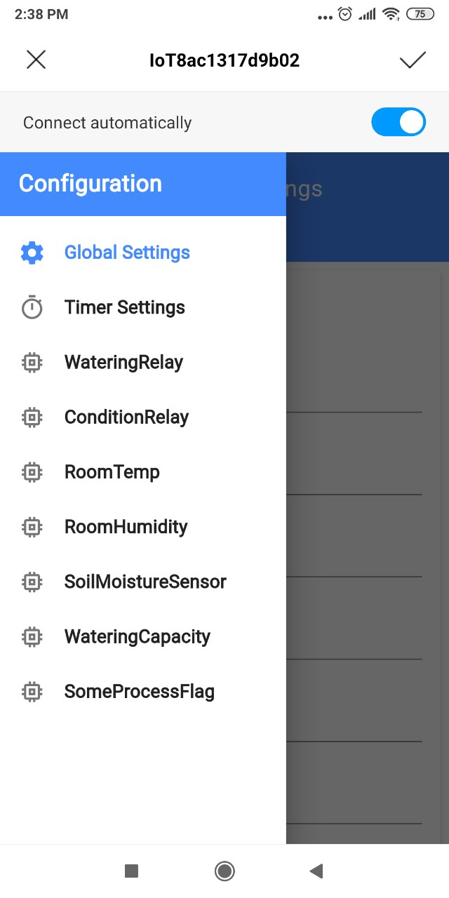
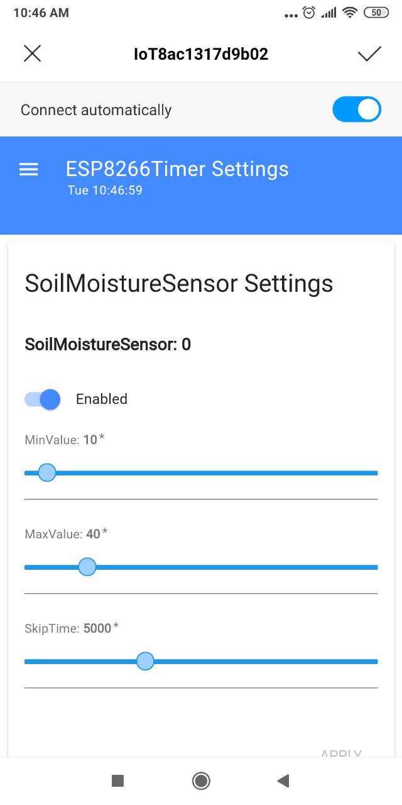

# GoFarmTech Arduino based Framework for developing agriculture/industry process automation device.

This library provides a full feautured framework for development of serverless multifunction microcontroller which able to controll process in unstable network connection environment. In some of the industry processes the cost of network failure is very high - e.g. watering process in agriculture. So the device should be able to handle process independently from server, but allow to communicate with the MQTT server when it's possible. This project was implemented with support of company Agrosheriff LTD.

## Main keys
 - Set of the sensor and relay classes are ready to use
 - Simple sensor registration (see [example](examples/main.cpp))
 - Framework examines every sensor and posts the value change to the MQTT server (if possible right now)
 - Sensor supports the value change event. The event handler is the best place for the device logic implementation
 - Sensor supports min/max value limits and events when the value reaches the limits
 - Built in multitask timer with various task execution strategies for building correct device logic
 - Device can be configured through the Web UI independenty from the server (Initial network setup, sensor limits, value examination frequency, etc)
 - Ready to use integration with [ioBroker](https://www.iobroker.net/) home automation system, which allows to controll and configure the device from the server: [ioBroker.gofarmtech](https://github.com/bratello/ioBroker.gofarmtech) adapter
 - Logging system for maintenance and diagnostics

## Dependencies and Requirements
 1. [Time](http://playground.arduino.cc/code/time): the device time will be updated from Web UI or from ioBroker automatically
 2. [DHT sensor library](https://github.com/adafruit/DHT-sensor-library)
 3. [PubSubClient](https://github.com/knolleary/pubsubclient): please install PubSubClient to the local lib folder and modify the PubSubClient::domain member's type from **const char\*** to the **String** (well known boggus pointer issue)
 4. [Arduino_JSON](http://github.com/arduino-libraries/Arduino_JSON)
 5. SPIFFS should be supported and available, in about 400K FS space is required.

## Build steps
 1. Create new project and install all dependencies and requirements
 2. Specify the data folder (data_dir in PlatformIO)
 3. Create settings.txt & values.txt files in data folder
 4. Specify the following keys in settings.txt file (without brackets or quotes, just a value after the equal sign)
    * deviceId=[Your device ID e.g.IoTMyConditionTimer - this ID will be used as Maintenance WiFi HotSpot name and as the MQTT channel ID]
    * deviceUsr=[Empty for now, for future use]
    * devicePwd=[Device Password for the maintenance]
    * ssid=[WiFi network name for ioBroker connection]
    * wifiPwd=[WiFi password]
    * mqttHost=[MQTT Broker IP e.g. 192.168.0.120]
    * mqttPort=[MQTT Broker Port, e.g. 1883]
    * mqttUsr=[MQTT Broker Username - can be empty]
    * mqttPwd=[MQTT Broker Password - can be empty]
 5. values.txt file can be empty
 6. Map the GoFarmTech/src/web/build folder to the %your_project_dir%/data/web folder (just symlink or copy)
 7. Upload data folder to the device: 'Upload File System Image' Task in PlatformIO. This step required only at the beginning
 8. Define SETTINGS_KNOB & SETTINGS_LED values in main.cpp (**before** any GoFarmTech library include file) for Maintencance Knob & Led definition
 9. Connect Knob and Led to the SETTINGS_KNOB & SETTINGS_LED pins
 10. Include library files and define the device main class with the device logic
 11. Add GoFarmTech entry to the lib_deps key in platformio.ini file
 12. See [example](examples/main.cpp) for the reference
 13. Compile and upload your project to the device
 14. Open the serial port console and check the runtime logs
 
## Initial device setup 
 1. Press for few seconds the Maintenace Knob attached to the SETTINGS_KNOB, the SETTINGS_LED led should flare up
 2. Open the WiFi settings on your smartphone and connect to the %deviceId% WiFi network (e.g. IoTMyConditionTimer). Specify %devicePwd% password for connecting to the device
 3. Wait for few seconds - the captive portal application will be opened
 
 4. Press the menu button and go to the Global Settings, specify the basic network configuration
 
 5. Press Apply button: device will be configured with your settings, the captive portal will be closed automatically, the SETTINGS_LED will be flare down
 6. Use the same method for the sensors or timer tasks configuration.
 
 
 7. Press Maintenace Knob at end of the configuration process, the Maintenance HotSpot will be closed automatically
 

## Known limitations
The Framework was tested on esp8266 platform only. Please open the issue in case of some questions or troubles, I'll answer as soon as I can. Feel free to modify this code, apply logs or implement your own sensors - any help is welcomed.

## Roadmap
 - esp32 support
 - Encrypt username & passwords in settings.txt file
 - Provide support for other sensors
 - LoRaWAN support (?)

## License
This code is released under the MIT License.
